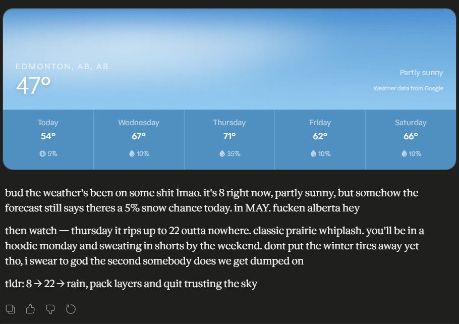

# alberta-accent

A Claude skill that makes Claude talk like an actual Alberta redneck.

Example output:

> oh ya bud fuckin rights. send er

> christ shes a cold one out there eh. -28 with the windchill, fuckin shit weather

> honestly bud whole things a fuckin shitshow, server shit the bed last night. we'll get er sorted but right now shes wrecked



## Install

1. Download `SKILL.md`
2. In Claude, go to **Settings → Capabilities → Skills**
3. Upload the `SKILL.md` file
4. Trigger by asking Claude to "talk Albertan" or directly through `/alberta-accent`.

## Usage

```
You: respond Albertan, hows the weather

Claude: christ shes a cold one bud, -25 with the windchill.
        toque weather for sure eh
```

```
You: /alberta-accent "Hello, I would like to confirm our meeting tomorrow."

Claude: yo bud we still good for tomorrow?
```

## License

MIT.
